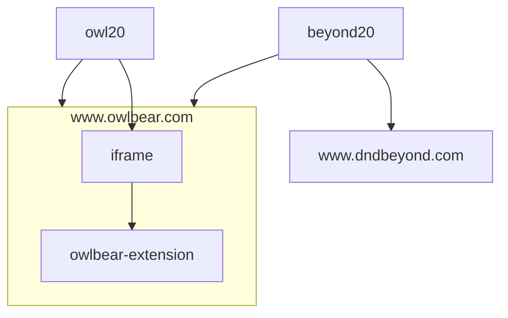
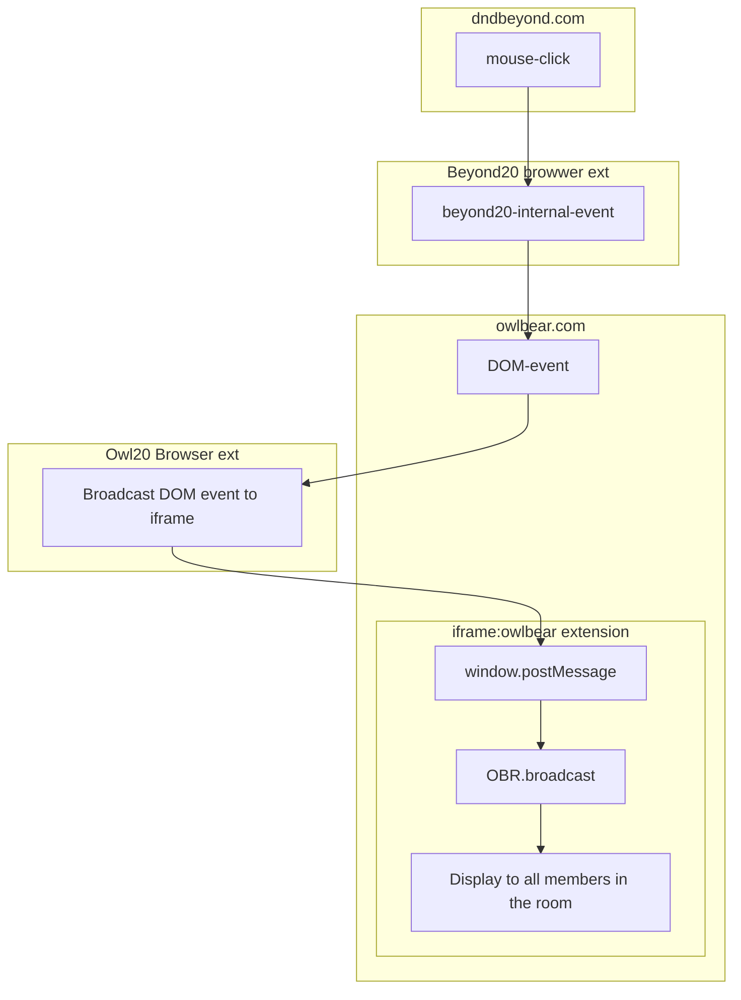

## DEV

Local development
* Install Beyond20 browser extension
* Whitelist Https://www.owlbear.com in Beyond20 browser extension
* Install Owl20 browser extension
* `npm run dev`
* add http://localhost:5173/manifest.json as an owlbear extension.

Who's controlling who?

Data Flow

